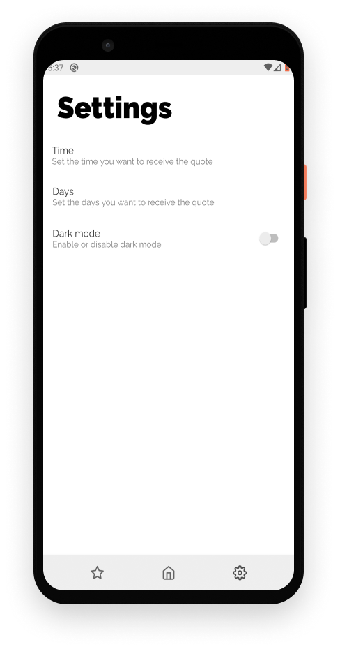
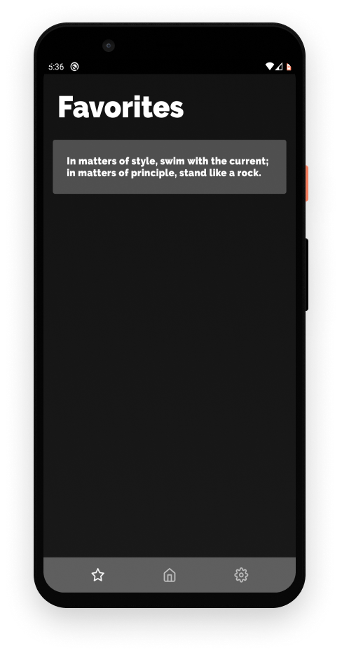

# Quotey

A quote app that sends you a quote when you need it,
you can specify the date and also the days you want to receive the quote

## Screenshots

## Libraries Used

- **Data Binding**
- **Lifecycle**
- **LiveData**
- **Room**
- **ViewModel**
- **WorkManager**
- **Glide**
- **Kotlin Coroutines**

## Goals

The focus of this project is on Clean with MVVM architecture and the Android framework.
Thus, there are plans to implement those features:

- **Navigation Component**
- **Dagger**
