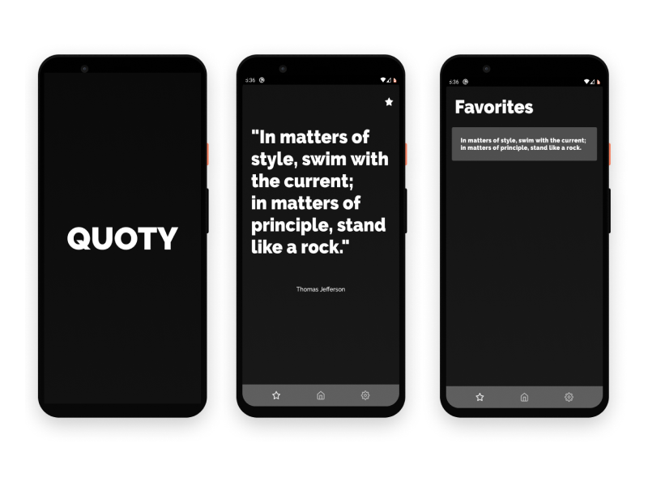
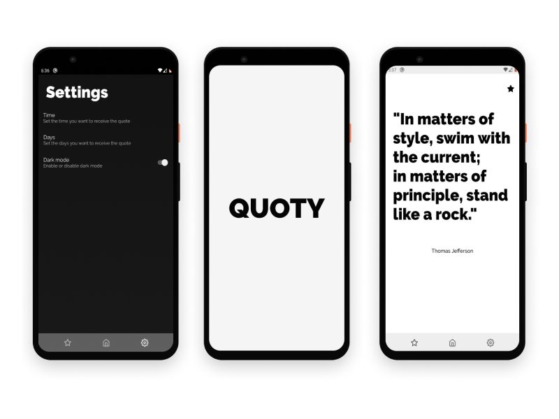
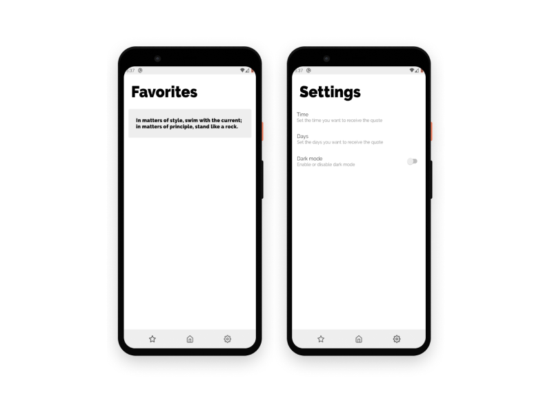

# Quotey

A quote app that sends you a quote when you need it,
you can specify the date and also the days you want to receive the quote

## Screenshots

    
    
    

## Goals

The focus of this project is on Clean with MVVM architecture and the Android framework.

## Libraries Used

- [**CircleImage**](https://github.com/hdodenhof/CircleImageView)
- [**Glide**](https://github.com/bumptech/glide)
- [**Koin**](https://github.com/InsertKoinIO/koin)
- [**KotlinCoroutines**](https://github.com/Kotlin/kotlinx.coroutines)
- [**DataBinding**](https://developer.android.com/topic/libraries/architecture)
- [**Lifecycle**](https://developer.android.com/topic/libraries/architecture)
- [**LiveData**](https://developer.android.com/topic/libraries/architecture)
- [**Moshi**](https://github.com/square/moshi/)
- [**Retrofit**](https://github.com/square/retrofit)
- [**ViewModel**](https://developer.android.com/topic/libraries/architecture)
- [**WorkManager**](https://developer.android.com/topic/libraries/architecture)
